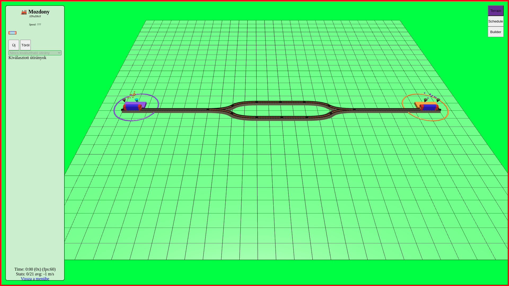

# Der Fahrplan

A game where you have to plan the train schedule ahead and adapt the continously changing travel-patterns. The more fitting schedule you make, the citizens will more happy and you earn more profit.

## Try it out (Demo)

Go to http://fahrplan.zsiri.eu/ and play along online. You will need a desktop computer with at least a 1024x768 resolution monitor, a full keyboard and a mouse with a wheel. Also you need a modern browser. (Suggested is Firefox or Chromium)

## Install and start locally

```
yarn install
yarn start
```

## It looks like this



## How to play

todo

## How it has been coded

[Click here to browse developer documentation](doc/index.md)
